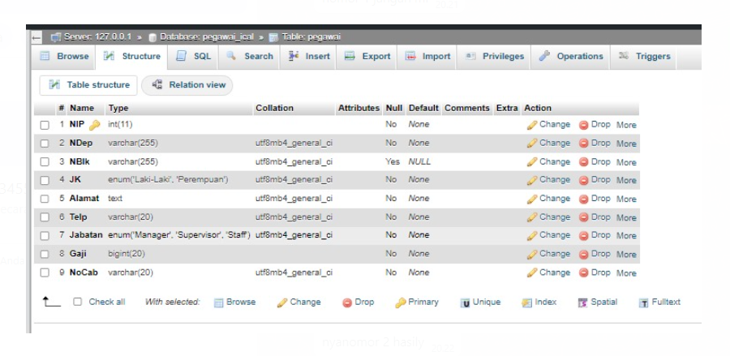
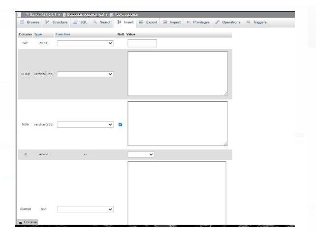
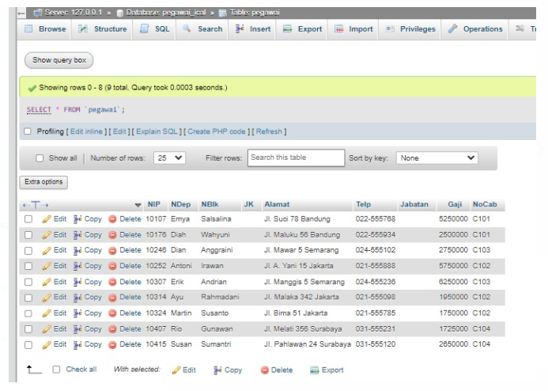

# 1. Membuat database dengan nama company_valen:

```
sql
CREATE DATABASE company_valen;
```


# 2. Membuat tabel pegawai dengan ketentuan yang diberikan:

```
sql
CREATE TABLE pegawai (
  NIP INT PRIMARY KEY,
  NDep VARCHAR(255) NOT NULL,
  NBlk VARCHAR(255),
  JK ENUM('Laki-laki', 'Perempuan') NOT NULL,
  Alamat TEXT NOT NULL,
  Telp VARCHAR(20) NOT NULL,
  Jabatan ENUM('Manager', 'Supervisor', 'Staff') NOT NULL,
  Gaji BIGINT NOT NULL,
  NoCab VARCHAR(255) NOT NULL
);
```
Penjelasannya:
1. **NIP (Nomor Induk Pegawai)**: Ini adalah primary key (kunci utama) dari tabel pegawai. Primary key berfungsi untuk mengidentifikasi setiap baris data secara unik. Tipe datanya adalah `INT` (integer).
    
2. **NDep (Nama Departemen)**: Ini adalah kolom yang menyimpan nama departemen tempat pegawai bekerja. Tipe datanya adalah `VARCHAR(255)`, yang berarti dapat menyimpan string (teks) dengan panjang maksimal 255 karakter. Kolom ini diberi atribut `NOT NULL`, artinya harus diisi.
    
3. **NBlk (Nama Blok)**: Ini adalah kolom yang menyimpan nama blok tempat pegawai bekerja. Tipe datanya juga `VARCHAR(255)`.
    
4. **JK (Jenis Kelamin)**: Ini adalah kolom yang menyimpan jenis kelamin pegawai. Tipe datanya adalah `ENUM`, yang berarti hanya boleh diisi dengan nilai yang sudah ditentukan, yaitu 'Laki-laki' atau 'Perempuan'. Kolom ini juga diberi atribut `NOT NULL`.
    
5. **Alamat**: Ini adalah kolom yang menyimpan alamat pegawai. Tipe datanya adalah `TEXT`, yang dapat menampung teks dengan panjang yang lebih besar daripada `VARCHAR`. Kolom ini juga diberi atribut `NOT NULL`.
    
6. **Telp (Telepon)**: Ini adalah kolom yang menyimpan nomor telepon pegawai. Tipe datanya adalah `VARCHAR(20)`, artinya dapat menampung string dengan panjang maksimal 20 karakter. Kolom ini juga diberi atribut `NOT NULL`.
    
7. **Jabatan**: Ini adalah kolom yang menyimpan jabatan pegawai. Tipe datanya adalah `ENUM` yang hanya boleh diisi dengan nilai 'Manager', 'Supervisor', atau 'Staff'. Kolom ini juga diberi atribut `NOT NULL`.
    
8. **Gaji**: Ini adalah kolom yang menyimpan gaji pegawai. Tipe datanya adalah `BIGINT`, yang dapat menampung nilai integer (bilangan bulat) yang lebih besar daripada `INT`. Kolom ini juga diberi atribut `NOT NULL`.
    
9. **NoCab (Nomor Cabang)**: Ini adalah kolom yang menyimpan nomor cabang tempat pegawai bekerja. Tipe datanya adalah `VARCHAR(255)`. Kolom ini juga diberi atribut `NOT NULL`.


Hasilnya:

# 3. Memasukkan data sesuai dengan gambar:
note: *pengisian isi table di insert

```
- Klik pada tabel pegawai di panel kiri
- Klik pada tab "Insert"
- lalu isi data
```
Penjelasannya:
1. **Klik pada tabel "pegawai" di panel kiri**:
    
    - Ini akan membuka tabel "pegawai" di panel utama, sehingga Anda dapat melihat struktur tabel dan data yang ada.
2. **Klik pada tab "Insert"**:
    
    - Setelah tabel "pegawai" terbuka, klik pada tab "Insert" yang terletak di bagian atas panel. Ini akan memunculkan form untuk mengisi data baru pada tabel.
3. **Mengisi data pada form**:
    
    - Pada form yang muncul, Anda dapat mengisi data untuk setiap kolom yang ada pada tabel "pegawai", sesuai dengan struktur tabel yang telah dijelaskan sebelumnya.
    - **NIP (Nomor Induk Pegawai)**: Isi dengan nomor induk pegawai yang unik.
    - **NDep (Nama Departemen)**: Isi dengan nama departemen tempat pegawai bekerja.
    - **NBlk (Nama Blok)**: Isi dengan nama blok tempat pegawai bekerja.
    - **JK (Jenis Kelamin)**: Pilih "Laki-laki" atau "Perempuan" sesuai dengan jenis kelamin pegawai.
    - **Alamat**: Isi dengan alamat lengkap pegawai.
    - **Telp (Telepon)**: Isi dengan nomor telepon pegawai.
    - **Jabatan**: Pilih "Manager", "Supervisor", atau "Staff" sesuai dengan jabatan pegawai.
    - **Gaji**: Isi dengan nilai gaji pegawai.
    - **NoCab (Nomor Cabang)**: Isi dengan nomor cabang tempat pegawai bekerja.
4. **Simpan data**:
    
    - Setelah semua data diisi, klik tombol "Go" atau "Simpan" untuk menyimpan data baru ke dalam tabel "pegawai".

Hasilnya:

sql
INSERT INTO pegawai (NIP, NDep, NBlk, JK, Alamat, Telp, Jabatan, Gaji, NoCab)
VALUE


 4. Struktur tabel pegawai:
Masukkan hasil struktur tabel pegawai tsb menggunakan perintah DESC                                                                                               pencet bagian sql lalu ketik

```
sql
DESC pegawai;
```

Hasilnya:
/


5. Data pada tabel pegawai:

Masukkan hasil data pada tabel pegawai menggunakan perintah SELECT                                                                                pencet sql lalu ketik

```
sql
SELECT * FROM pegawai;
```
1. **SELECT**:
    
    - Kata kunci `SELECT` digunakan untuk menentukan kolom-kolom yang ingin ditampilkan dari tabel.
    - Dalam kasus ini, `*` (asterisk) digunakan, yang berarti menampilkan semua kolom yang ada di tabel.
2. **FROM**:
    
    - Kata kunci `FROM` digunakan untuk menentukan tabel yang akan diambil datanya.
    - Dalam kasus ini, tabel yang akan diambil datanya adalah `pegawai`.
3. **Tabel `pegawai`**:
    
    - Tabel `pegawai` adalah tabel yang berisi informasi tentang pegawai, sesuai dengan struktur tabel yang telah dijelaskan sebelumnya.
    - Tabel ini memiliki 9 kolom, yaitu: `NIP`, `NDep`, `NBlk`, `JK`, `Alamat`, `Telp`, `Jabatan`, `Gaji`, dan `NoCab`.

Jadi, ketika perintah `SELECT * FROM pegawai;` dijalankan, database akan mengembalikan semua data yang ada di dalam tabel `pegawai`, dengan menampilkan semua kolom yang tersedia.

Hasil dari perintah ini akan menampilkan baris-baris data pegawai, dengan masing-masing baris berisi informasi lengkap mengenai seorang pegawai, sesuai dengan kolom-kolom yang ada di tabel.

Perintah ini sangat berguna ketika Anda ingin melihat seluruh data yang tersimpan dalam tabel `pegawai`, misalnya untuk keperluan analisis, pembuatan laporan, atau tujuan lainnya.


Hasilnya:
